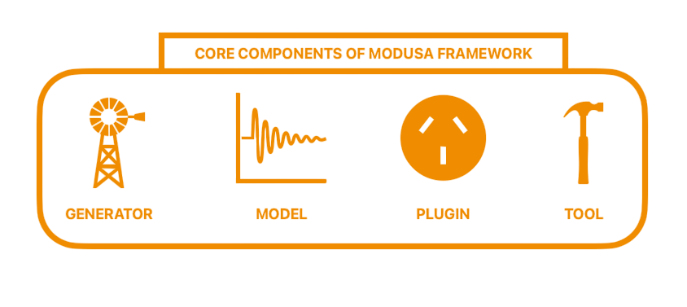

modusa
======

**modusa** is a modular framework for audio signal analysis and processing, designed to help researchers and developers build reusable DSP chains with minimal code.

   
.. admonition:: **These are the 4 core components of modusa architecture**

      - modusa **Engine**: Contains the core logic for processing and transforming signals.
      - modusa **Plugin**: A thin layer that connects engines to signals for execution.
      - modusa **Signal**: Represents data with domain-specific tools (e.g., audio, music, etc).
      - modusa **Generator**: Creates new signals using predefined rules or patterns.

.. toctree::
   :maxdepth: 1
   :caption: Quick Guide
   
   examples/index

.. toctree::
   :maxdepth: 2
   :caption: API Reference
   
   signals/index
   plugins/index
   generators/index
   io/index
   engines/index

.. toctree::
   :maxdepth: 1
   :caption: How to contribute
   
   contrib/contribution_guidelines
   contrib/engine_creation_guide
   contrib/plugin_creation_guide
   
   
   

